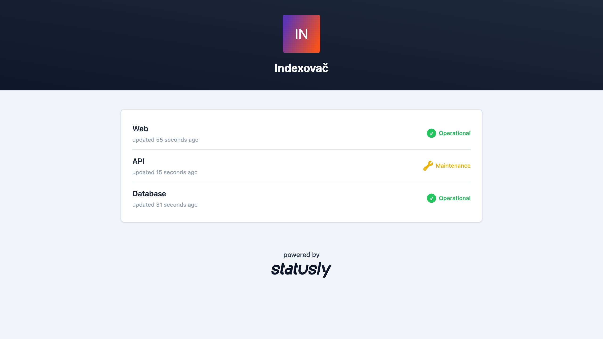
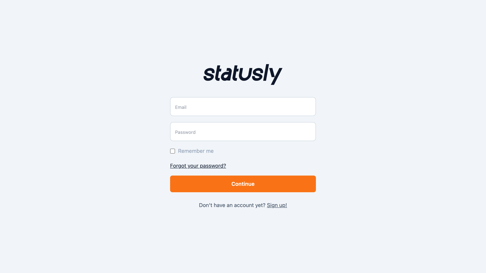
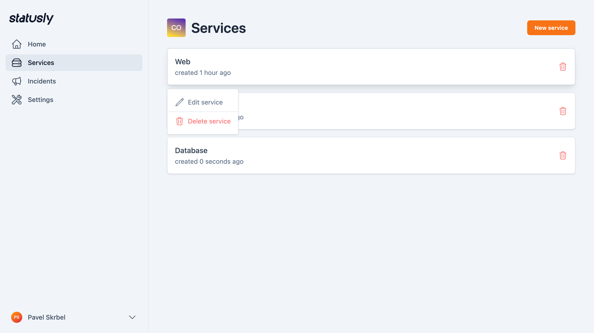
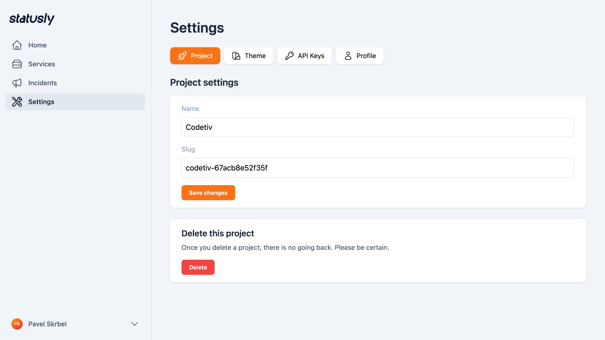

    

# What is statusly 🚀

A simple and elegant status page generator built with the modern stack of **Laravel**, **Livewire** and **Tailwind**.

**statusly** is a lightweight, self-hosted status page generator designed to keep your users informed about system uptime, incidents, and maintenance events. Built with Laravel, it provides an intuitive interface to display service statuses effortlessly.

## 🛠️ Tech Stack

- 
- 
- 
- 

## Screenshots

